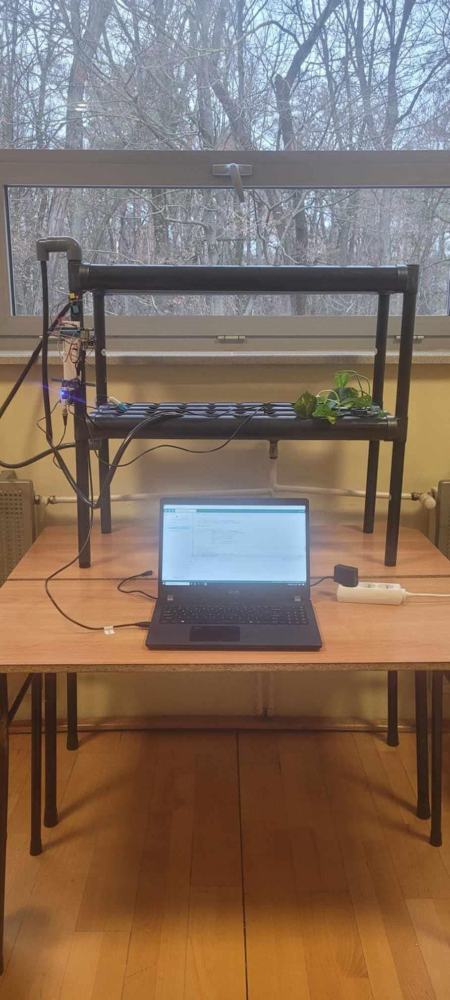
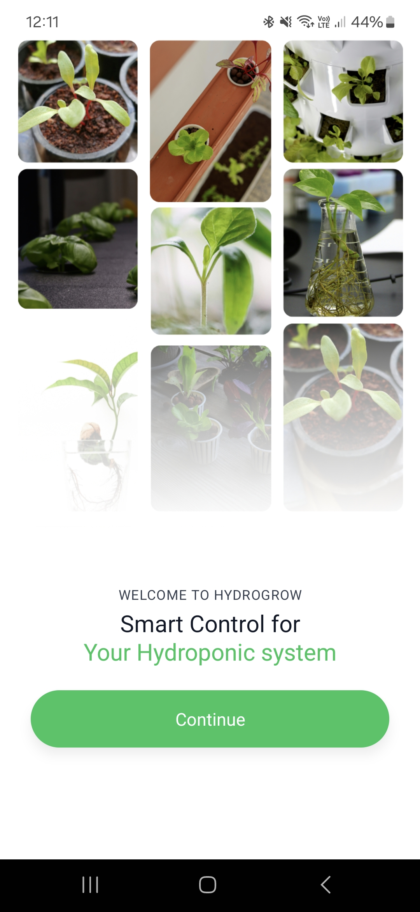
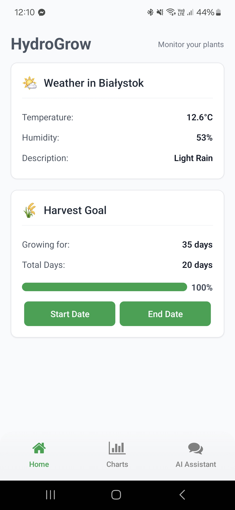
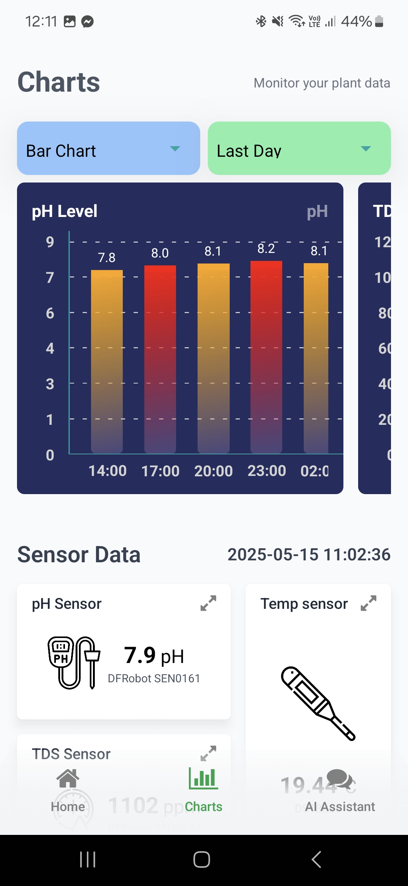
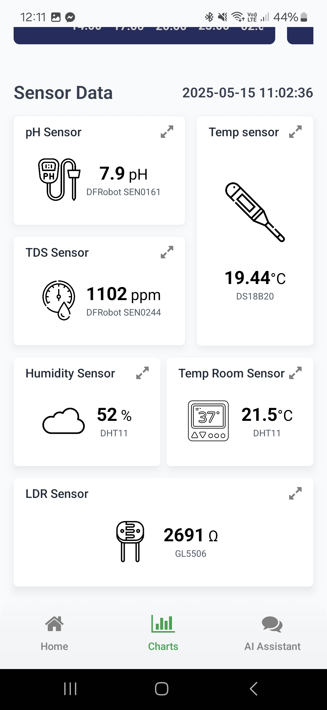
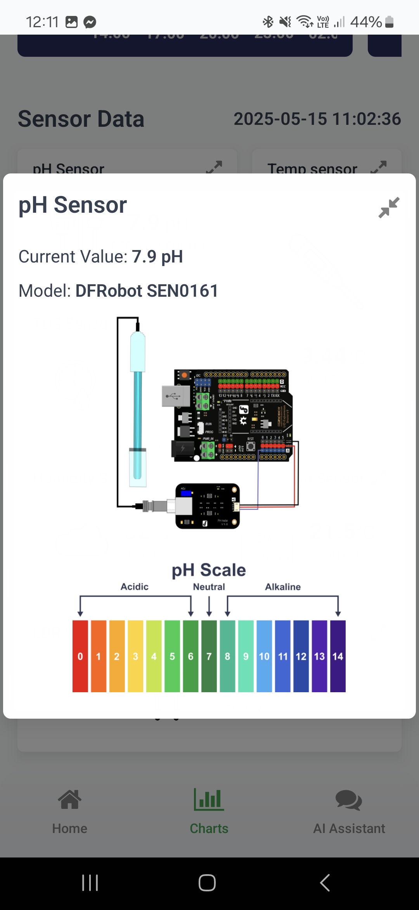
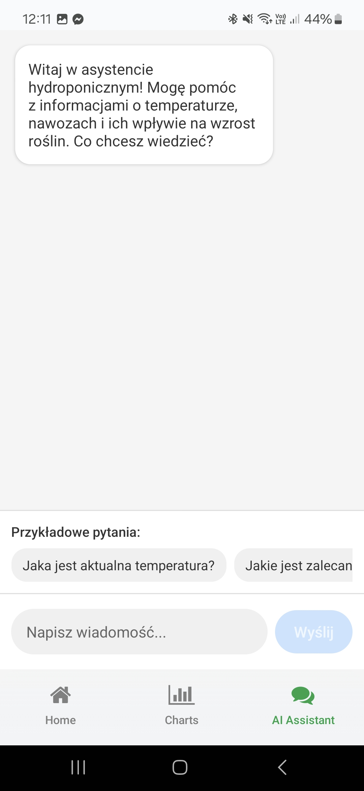
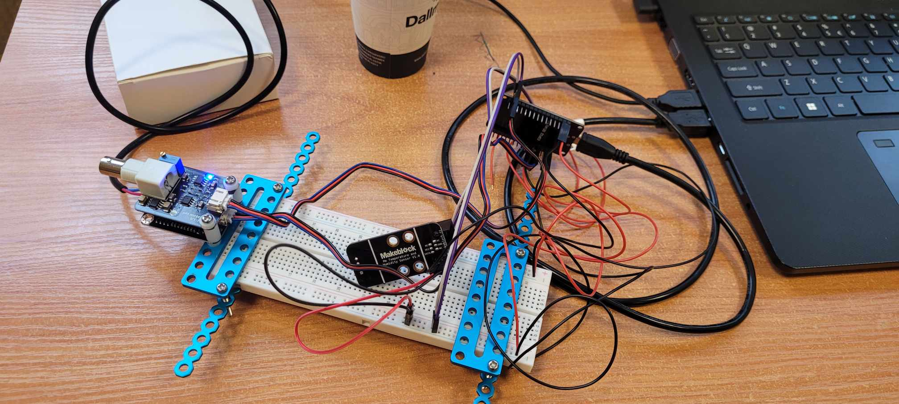

# HydroGrow

**HydroGrow** is a mobile app built for a competition to monitor plant parameters and help you take better care of your plants.

---

## 🌿 Device & Sensors

The hardware setup you built consists of:

- **ESP32** — main controller  
- **DFRobot Gravity analog pH sensor/meter** — analog pH meter compatible with Arduino  
- **DFRobot SEN0244** — measures water purity and hardness (TDS)  
- **DS18B20** — water temperature sensor  
- **DHT11** — room temperature and humidity sensor  
- **LDR + resistor** — for light intensity detection  

All sensor readings are sent to the **ESP32**, which connects to **Wi-Fi** and uploads data to **Firebase Realtime Database**.

The mobile app fetches the real-time data and displays it in interactive charts.

---

## 🚀 Welcome Screen

When you open the app, you’ll see a welcome screen to get you started.

---

## 🏡 Home Screen

The main screen shows:

- Current weather information (from an API)
- How many days your plant has been growing

---

## 📊 Monitoring Tab

Here you can track real-time parameters for your plant:

- **pH level**
- **TDS** (Total Dissolved Solids)
- **Water temperature**
- **Room temperature**
- **Humidity**
- **Lighting** (LDR sensor)

All values are displayed on graphs with the option to change time ranges and view trends:

You can also check which sensors are currently connected and active:

---

## 🤖 AI Assistant

The third tab features an AI assistant. Ask questions and get real-time advice on how to care for your plant.

---

## 🛠 Technologies Used

- **React Native / Expo** — for mobile app development  
- **Firebase Realtime Database** — for storing sensor data  
- **Weather API** — for live weather updates  
- **ESP32** — microcontroller for sensor data collection  
- **Multiple sensors** — analog and digital

---
